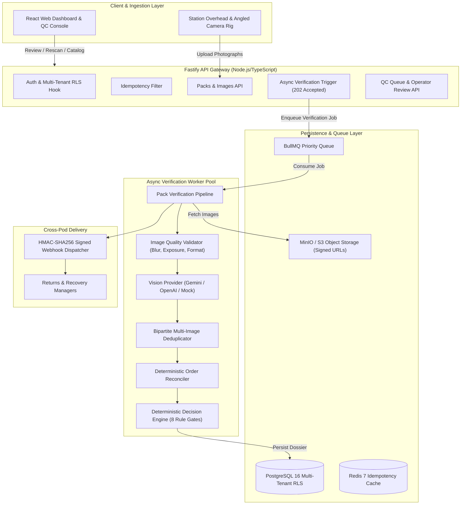

# Pack Manager — System Architecture & Engineering Reference

## 1. System Overview

**Pack Manager** is an enterprise-grade outbound verification system designed for merchant-fulfilled sellers and 3PL fulfillment centers. Positioned at **Step 3 of 5** (Outbound to Buyer), the system inspects open packages prior to taping and carton sealing, comparing observed contents against expected order lines.

### Core Philosophy
1. **AI Observes, Code Decides:** Computer vision detects candidate objects and attributes; pure deterministic TypeScript code performs quantity reconciliation, variant verification, and fulfillment decision gating. No probabilistic LLM hallucination may trigger a carton seal.
2. **Binary Operational Routing:** Physical lines support exactly two mechanical states: `SEAL` or `STOP_AND_FIX`.
3. **Multi-Tenancy (Engineering Rule 1):** Complete database Row-Level Security (RLS) and storage path partitioning across organizations (`org_demo_alpha`, `org_demo_bravo`).
4. **Asynchronous Non-Blocking Processing:** Fastify REST API acknowledges requests in `< 100ms` with `202 Accepted`, delegating inference to an autoscaling BullMQ worker pool.

---

## 2. High-Level Component Architecture

---

## 3. The 8 Deterministic Rule Gates

Every package analysis must pass all 8 gates to receive a `SEAL` operational verdict:

1. **Image Quality Gate:** Rejects corrupted, sub-resolution (< 1280x720), motion-blurred ($\sigma^2 < 100$), or severely underexposed photos $\to$ `STOP_AND_FIX` (`POOR_IMAGE_QUALITY`).
2. **Vision Provider Status Gate:** Any model timeout, 500 error, or malformed schema execution halts immediately without blocking conveyor $\to$ `STOP_AND_FIX` (`VISION_FAILURE`).
3. **Ambiguity Gate:** Items with unresolvable candidate scores or low confidence are flagged $\to$ `STOP_AND_FIX` (`AMBIGUOUS_ITEM`).
4. **Missing Items Gate:** Any expected order item with count 0 in the box $\to$ `STOP_AND_FIX` (`MISSING_ITEM`).
5. **Wrong Items Gate:** Any item present in the box that is absent from customer order lines $\to$ `STOP_AND_FIX` (`WRONG_ITEM`).
6. **Quantity Gate:** Integer count of detected items must equal expected quantity exactly ($N_{\text{obs}} == N_{\text{exp}}$) $\to$ `STOP_AND_FIX` (`QUANTITY_MISMATCH`).
7. **Critical Variant Gate:** Attributes designated in product catalog (e.g. `color`, `size`, `model`) must match $\to$ `STOP_AND_FIX` (`VARIANT_MISMATCH`).
8. **Confidence Threshold Gate:** Overall identification confidence must satisfy configured threshold ($\ge 0.88$) $\to$ `STOP_AND_FIX` (`LOW_CONFIDENCE`).
